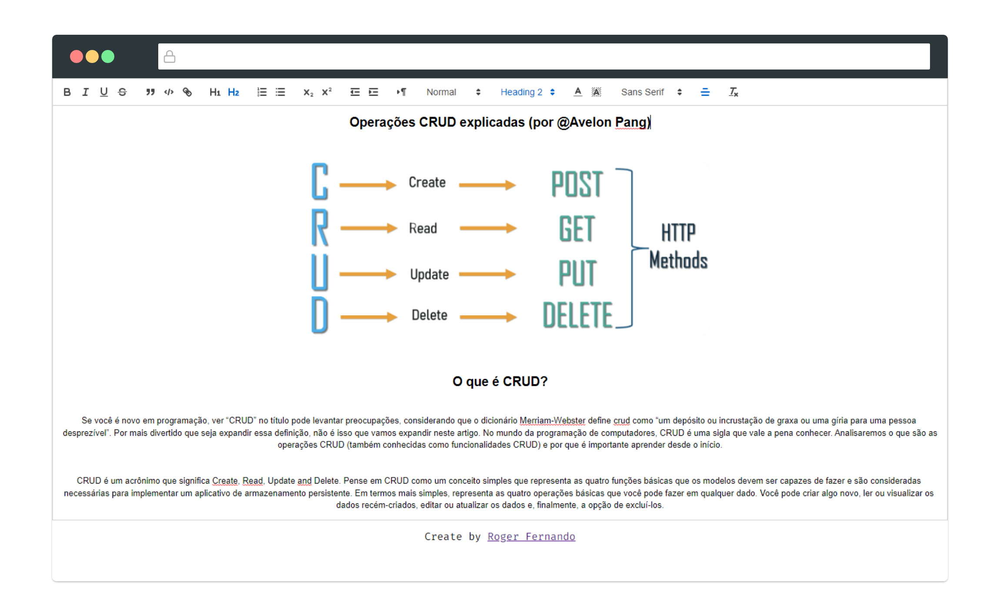

<h1 align="center">
  
</h1>

<p align="center">
  
  
  
  
  
</p>

<div align="center">
  
</div>

## Project

This project was created with people in mind who need to take quick and simple notes. Texteditor brings everything needed to create hypertexts in a simple way. You can view the layout of this project by clicking [here](http://texteditor-phi.vercel.app/).

## Installation:

You will need [Nodejs](https://nodejs.org/en/) and [git](https://git-scm.com/) installed on your machine. Then, you can run the scripts below:

```bash
# Clone this repository
$ git clone https://github.com/abantes/texteditor.git

# Access the project folder in the cmd/terminal
$ cd texteditor

# Install the dependencies
$ npm install

# Run the application in development mode
$ npm run dev

# The port that the server will open will be shown on the console
```

## Environment Support

| [](http://godban.github.io/browsers-support-badges/)<br>IE / Edge | [](http://godban.github.io/browsers-support-badges/)<br>Firefox | [](http://godban.github.io/browsers-support-badges/)<br>Chrome | [](http://godban.github.io/browsers-support-badges/)<br>Safari |
| --- | --- | --- | --- |
| IE11, Edge | last 5 versions | last 5 versions | last 5 versions |

## How to contribute

Contributions are always welcome, no matter how large or small.

1. Fork this repository;
2. Create a branch with your feature: **`git checkout -b my-feature`**;
3. Commit your changes: **`git commit -m 'feat: My new feature'`**;
4. Push to your branch: **`git push origin my-feature`**.

After the merge of your pull request is done, you can delete your branch.

You can report a bug [here](https://github.com/abantes/texteditor/issues).

## License

This project is under the MIT license. See the archive [LICENSE](LICENSE.md) for more details.
